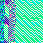

#Img2Pic

##About
Our project takes any MIDI file within the <code>music/</code> directory and takes the tick and data elements of the file to create an image. It's pretty lit tbh.

##Demo
Starboy by The Weeknd:

24K Magic by Bruno Mars:

Black Beatles by Rae Sremmurd:

##Requirements:
- PIL (installable through pip)
- [python-midi](https://github.com/vishnubob/python-midi)

##Installation:
- Clone the repo
- Add any MIDI files to the <code>music/</code> directory
- run <code>python index.py</code>
- View your generated images in the images directory

##DISCLAIMER: None of the songs are our own and are the property of their rightful owners.
